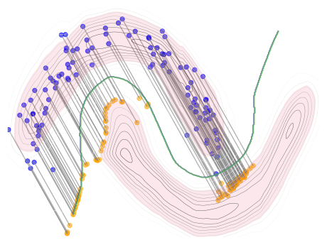
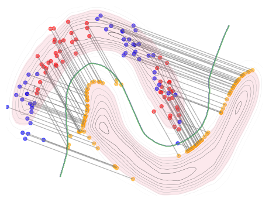
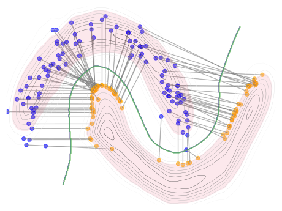

# Unifying Perspectives: Plausible Counterfactual Explanations on Global, Group-wise, and Local Levels

This repository contains the official implementation of a unified framework for generating plausible counterfactual explanations (CFs) across global, group-wise, and local levels. Our method enhances transparency in AI systems by combining gradient-based optimization with probabilistic plausibility constraints, enabling stakeholders to audit models.

<p align="center" style="display: flex; justify-content: center; gap: 20px">
  
  
  
</p>

## Abstract

The growing complexity of AI systems has intensified the need for transparency through Explainable AI (XAI). Counterfactual explanations (CFs) offer actionable "what-if" scenarios on three levels: Local CFs providing instance-specific insights, Global CFs addressing broader trends, and Group-wise CFs (GWCFs) striking a balance and revealing patterns within cohesive groups. Despite the availability of methods for each granularity level, the field lacks a unified method that integrates these complementary approaches. We address this limitation by proposing a gradient-based optimization method for differentiable models that generates Local, Global, and Group-wise Counterfactual Explanations in a unified manner. We especially enhance GWCF generation by combining instance grouping and counterfactual generation into a single efficient process, replacing traditional two-step methods. Moreover, to ensure trustworthiness, we pioneer the integration of plausibility criteria into the GWCF domain, making explanations both valid and realistic. Our results demonstrate the method's effectiveness in balancing validity, proximity, and plausibility while optimizing group granularity, with practical utility validated through practical use cases.

## Table of Contents

- [Introduction](#introduction)
- [Prerequisites](#prerequisites)
- [Getting Started](#getting-started)
- [Code Structure](#code-structure)
- [Data](#data)
- [Experiments](#experiments)
- [Citation](#citation)
- [Contact](#contact)

## Key Features

### ✨ Unified Multi-Level Explanations
Generate CFs at global, group-wise, or local levels using a single framework. Dynamically adjust granularity via hyperparameters.

### ✨ Plausibility Guarantees
Enforce realistic counterfactuals using normalizing flows, ensuring explanations lie within high-density regions of the target class distribution.

## Prerequisites

This section details the environment setup, including necessary libraries and frameworks. To clone the repository and set up the environment, use the following commands:

```shell
git clone TBA
cd counterfactuals
./setup_env.sh
```

## Getting Started
The following Python code snippet demonstrates how to use the framework for generating counterfactual explanations:

```python
import torch
import numpy as np
from counterfactuals.datasets import MoonsDataset
from counterfactuals.losses import MulticlassDiscLoss
from counterfactuals.cf_methods import PUMAL
from counterfactuals.generative_models import MaskedAutoregressiveFlow
from counterfactuals.discriminative_models import MultilayerPerceptron
from counterfactuals.metrics import CFMetrics


dataset = MoonsDataset("../data/moons.csv")
train_dataloader = dataset.train_dataloader(batch_size=128, shuffle=True)
test_dataloader = dataset.test_dataloader(batch_size=128, shuffle=False)

disc_model = MultilayerPerceptron(dataset.X_test.shape[1], [512, 512], dataset.y_test.shape[1])
disc_model.fit(train_dataloader, test_dataloader)
disc_model.eval()


dataset.y_train = dataset.y_transformer.transform(
    disc_model.predict(dataset.X_train).detach().numpy().reshape(-1, 1)
)
dataset.y_test = dataset.y_transformer.transform(
    disc_model.predict(dataset.X_test).detach().numpy().reshape(-1, 1)
)

train_dataloader = dataset.train_dataloader(batch_size=256, shuffle=True, noise_lvl=0.03)
test_dataloader = dataset.test_dataloader(batch_size=256, shuffle=False)
gen_model = MaskedAutoregressiveFlow(
    features=dataset.X_train.shape[1], hidden_features=16, context_features=dataset.y_test.shape[1]
)
gen_model.fit(train_dataloader, test_dataloader, num_epochs=1000)

source_class = 0
target_class = 1
X_test_origin = dataset.X_test[np.argmax(dataset.y_test, axis=1) == source_class]
y_test_origin = dataset.y_test[np.argmax(dataset.y_test, axis=1) == source_class]

cf_method = PUMAL(
    X=X_test_origin,
    cf_method_type="GCE",
    K=6,
    gen_model=gen_model,
    disc_model=disc_model,
    disc_model_criterion=MulticlassDiscLoss(),
    not_actionable_features=None,
    neptune_run=None,
)
log_prob_threshold = torch.quantile(gen_model.predict_log_prob(dataset.test_dataloader(batch_size=4096, shuffle=False)), 0.25)
cf_dataloader = torch.utils.data.DataLoader(
    torch.utils.data.TensorDataset(
        torch.tensor(X_test_origin).float(),
        torch.tensor(y_test_origin).float(),
    ),
    batch_size=4096,
    shuffle=False,
)
delta, Xs, ys_orig, ys_target = cf_method.explain_dataloader(
    dataloader=cf_dataloader,
    target_class=target_class,
    epochs=20000,
    lr=0.01,
    patience=500,
    alpha_dist=1e-1,
    alpha_plaus=10**4,
    alpha_class=10**5,
    alpha_s=10**4,
    alpha_k=10**3,
    alpha_d=10**2,
    log_prob_threshold=log_prob_threshold,
)
Xs_cfs = Xs + delta().detach().numpy()

metrics = CFMetrics(
    X_cf=Xs_cfs,
    y_target=ys_target,
    X_train=dataset.X_train,
    y_train=dataset.y_train,
    X_test=X_test_origin,
    y_test=y_test_origin,
    disc_model=disc_model,
    gen_model=gen_model,
    continuous_features=list(range(dataset.X_train.shape[1])),
    categorical_features=dataset.categorical_features,
    prob_plausibility_threshold=log_prob_threshold,
)
print(metrics.calc_all_metrics())
```
### Jupyter notebook
You can find the example of running algorithm in the jupyter notebook at: [here](notebooks/pumal_demo.ipynb)

### Pre-trained Models

We publish pre-trained models in the `./models/` directory for immediate use and experimentation.

## Code Structure

The repository is organized as follows to facilitate ease of use and contribution:

```
|── data/                  # Datasets
|── models/                # Trained models
|── notebooks/             # Jupyter notebooks for analysis and examples
|── counterfactuals/       # Source code for the framework
|   ├── cf_methods/        # Counterfactual methods
|   ├── discriminative_models/  # Discriminative models for analysis
|   ├── generative_models/      # Generative models for analysis
|   ├── losses/            # Loss functions
|   ├── metrics/           # Evaluation metrics
|   └── pipelines/         # Data and model pipelines
|── README.md              # This document
└── ...
```

## Data

The full data folder can be found under the following link: [Link](data). More details regarding the datasets can be found in the paper in the appendix directory.

## Experiments

To run experiments, prepare the configuration files located in the `counterfactuals/pipelines/conf/` directory:

Execute the following scripts to train models and run experiments for our method:

```shell
python3 counterfactuals/pipelines/run_pumal_pipeline.py
```

## Citation
```
TBA
```
## Contact

In case of questions or comments please contact using LinkedIn: TBA
