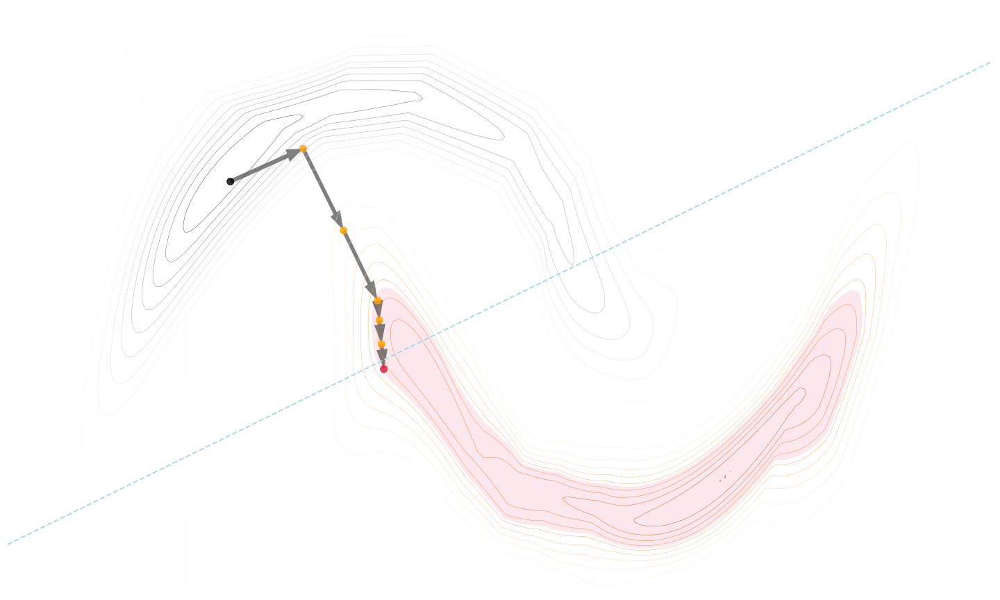

# PPCEF: Probabilistically Plausible Counterfactual Explanations using Normalizing Flows

This repository is dedicated to the research and development of **PPCEF** (Probabilistically Plausible Counterfactual Explanations using Normalizing Flows), a novel method designed for generating and evaluating counterfactual explanations in machine learning models. The project aims to enhance model interpretability and fairness by providing insights into alternative scenarios that change a model's decision.

<p align="center">

</p>

## Abstract

We present **PPCEF**, a novel method specifically tailored for generating probabilistically plausible counterfactual explanations. This approach utilizes normalizing flows as density estimators within an unconstrained optimization framework, effectively balancing distance, validity, and probabilistic plausibility in the produced counterfactuals. Our method is notable for its computational efficiency and ability to process large and high-dimensional datasets, making it particularly applicable in real-world scenarios. A key aspect of **PPCEF** is its focus on the plausibility of counterfactuals, ensuring that the generated explanations are coherent and realistic within the context of the original data. Through comprehensive experiments across various datasets and models, we demonstrate that **PPCEF** can successfully generate high-quality counterfactual explanations, highlighting its potential as a valuable tool in enhancing the interpretability and transparency of machine learning systems.

## Table of Contents

- [Introduction](#introduction)
- [Prerequisites](#prerequisites)
- [Getting Started](#getting-started)
- [Code Structure](#code-structure)
- [Data](#data)
- [Experiments](#experiments)
- [Citation](#citation)
- [Contact](#contact)

## Introduction

Counterfactual explanations offer a way to understand machine learning model decisions by explaining what minimal changes would alter a prediction. This project introduces **PPCEF**, a method that leverages optimization and machine learning techniques to generate plausible counterfactuals. Our approach ensures that the generated counterfactuals are not only close to the original data points but also adhere to domain-specific constraints, making them realistic and actionable for decision-makers.

## Prerequisites

This section details the environment setup, including necessary libraries and frameworks. To clone the repository and set up the environment, use the following commands:

```shell
git clone https://github.com/{repository}/ppcef.git
cd ppcef
pip install -e .
```

## Getting Started
The following Python code snippet demonstrates how to use the PPCEF framework for generating counterfactual explanations:

```python
from nflows.flows import MaskedAutoregressiveFlow

from counterfactuals.datasets import MoonsDataset
from counterfactuals.optimizers.ppcef import PPCEF
from counterfactuals.discriminative_models import LogisticRegression
from counterfactuals.losses import BinaryDiscLoss
from counterfactuals.utils import plot_model_distribution


dataset = MoonsDataset("../data/moons.csv")
train_dataloader = dataset.train_dataloader(batch_size=16, shuffle=True)
test_dataloader = dataset.test_dataloader(batch_size=16, shuffle=False)

disc_model = LogisticRegression(dataset.X_test.shape[1], 1)
disc_model.fit(train_dataloader)

gen_model = MaskedAutoregressiveFlow(dataset.X_test.shape[1], 4, 1)
cf = PPCEF(
    gen_model=gen_model,
    disc_model=disc_model,
    disc_model_criterion=BinaryDiscLoss(),
    neptune_run=None,
    checkpoint_path="model.pt"
)
cf.train_model(train_dataloader,test_dataloader)
median_log_prob = cf.calculate_median_log_prob(train_dataloader)
X_cf, X_orig, y_orig = cf.search_batch(test_dataloader, alpha=100, delta=median_log_prob)
```

### Pre-trained Models

We publish pre-trained models in the `./models/` directory for immediate use and experimentation.

## Code Structure

The repository is organized as follows to facilitate ease of use and contribution:

```
|── conf/                 # Configuration files
|── data/                 # Datasets
|── models/               # Trained models
|── notebooks/            # Jupyter notebooks for analysis and examples
├── counterfactuals/      # Source code for the framework
|── README.md             # This document
|── alternative_methods/  # Referense methods experiments code
|── train_disc_model.py   # Discriminative models training code
|── train_gen_model.py    # Generative models training code
|── run_experiment.py     # File that contains experiments with PPCEF method
└── ...
```

Source code in `counterfactuals/` directory contains the following:
  * `datasets` - Kedro wrappers for the TreeFlow model and UCI Datasets.
  * `discriminative_models` - Discriminative models implementations.
  * `generative_models` - Generative models implementations.
  * `losses` - Implementation of the proposed loss function.
  * `metrics` - Calculations of metrics.
  * `optimizers` - Implementation of **PPCF** method
  * `artelth20` - Plausible Counterfactual Explanations by [André Artelt and Barbara Hammer](https://github.com/andreArtelt/ConvexDensityConstraintsForPlausibleCounterfactuals/tree/master).
  * `sace` - Implementations of refenrence methods by [Riccardo Guidotti](https://github.com/riccotti/Scamander/tree/main/sace)

## Data

The full data folder can be found under the following link: [Link](data). More details regarding the datasets can be found in the paper in the appendix directory.

## Experiments

To run experiments, prepare the configuration files located in the conf/ directory:

- [config_train_disc_model.yaml](conf/config_train_disc_model.yaml)
- [config_train_gen_model.yaml](conf/config_train_gen_model.yaml)
- [config.yaml](conf/config.yaml)

Execute the following scripts to train models and run experiments:

```shell
python3 train_disc_model.py # train disc model
python3 train_gen_model.py # train gen model
python3 run_experiment.py # run experiment
```

## Citation

TBA

## Contact

In case of questions or comments please contact using LinkedIn: TBA
