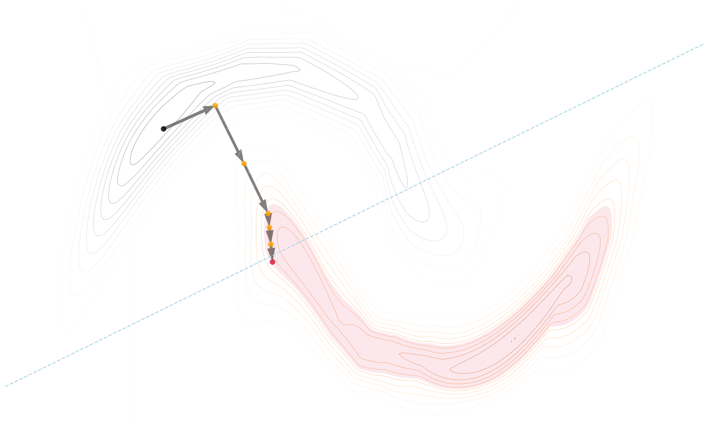

# PPCEF: Probabilistically Plausible Counterfactual Explanations using Normalizing Flows

This repository is dedicated to the research and development of **PPCEF** (Probabilistically Plausible Counterfactual Explanations using Normalizing Flows), a novel method designed for generating and evaluating counterfactual explanations in machine learning models. The project aims to enhance model interpretability and fairness by providing insights into alternative scenarios that change a model's decision.

<p align="center">

</p>

## Abstract

We present **PPCEF**, a novel method specifically tailored for generating probabilistically plausible counterfactual explanations. This approach utilizes normalizing flows as density estimators within an unconstrained optimization framework, effectively balancing distance, validity, and probabilistic plausibility in the produced counterfactuals. Our method is notable for its computational efficiency and ability to process large and high-dimensional datasets, making it particularly applicable in real-world scenarios. A key aspect of **PPCEF** is its focus on the plausibility of counterfactuals, ensuring that the generated explanations are coherent and realistic within the context of the original data. Through comprehensive experiments across various datasets and models, we demonstrate that **PPCEF** can successfully generate high-quality counterfactual explanations, highlighting its potential as a valuable tool in enhancing the interpretability and transparency of machine learning systems.

## Table of Contents

- [PPCEF: Probabilistically Plausible Counterfactual Explanations using Normalizing Flows](#ppcef-probabilistically-plausible-counterfactual-explanations-using-normalizing-flows)
  - [Abstract](#abstract)
  - [Table of Contents](#table-of-contents)
  - [Introduction](#introduction)
  - [Available Methods](#available-methods)
    - [Global Methods](#global-methods)
    - [Group Methods](#group-methods)
    - [Local Methods](#local-methods)
  - [Prerequisites](#prerequisites)
  - [Getting Started](#getting-started)
    - [Jupyter notebook](#jupyter-notebook)
    - [Pre-trained Models](#pre-trained-models)
  - [Code Structure](#code-structure)
  - [Data](#data)
  - [Experiments](#experiments)
  - [Library Guide](#library-guide)
  - [Pipeline Guide](#pipeline-guide)
  - [Contributing](#contributing)
  - [Citation](#citation)
  - [Contact](#contact)

## Introduction

Counterfactual explanations offer a way to understand machine learning model decisions by explaining what minimal changes would alter a prediction. This project introduces **PPCEF**, a method that leverages optimization and machine learning techniques to generate plausible counterfactuals. Our approach ensures that the generated counterfactuals are not only close to the original data points but also adhere to domain-specific constraints, making them realistic and actionable for decision-makers.

Beyond PPCEF, this repository provides a comprehensive framework implementing various state-of-the-art counterfactual explanation methods across three categories: **Global**, **Group**, and **Local** methods.

## Available Methods

This framework implements multiple counterfactual explanation methods. Below is a comprehensive overview of all available methods organized by category.

### Global Methods

Methods that generate counterfactual explanations at a global level, providing insights across the entire dataset.

| Method | Status | Description |
|--------|--------|-------------|
| ARES | ✅ Available | Actionable Recourse with Ensemble Sampling |
| GLOBE-CE | ✅ Available | Global Counterfactual Explanations |

### Group Methods

Methods that generate counterfactual explanations for groups of instances.

| Method | Status | Description |
|--------|--------|-------------|
| GLANCE | ✅ Available | Group-Level Counterfactual Explanations |
| Group PPCEF | ✅ Available | Group-based Plausible Probabilistic Counterfactual Explanations |
| T-CREx | ❌ Not Available | Temporally Constrained Counterfactual Explanations |
| PUMAL | ℹ️ In Repository | Present in codebase (status unclear) |

### Local Methods

Methods that generate counterfactual explanations for individual instances.

| Method | Status | Description |
|--------|--------|-------------|
| WACH | ✅ Available | Weighted Average of Counterfactual Hypotheses |
| Artelt | ✅ Available | Artelt's counterfactual method |
| CCHVAE | ✅ Available | Conditional Constrained VAE |
| Casebased SACE | ✅ Available | Case-based Sparse Actionable Counterfactual Explanations |
| CEGP | ✅ Available | Counterfactual Explanations via Gaussian Processes |
| CEM | ✅ Available | Contrastive Explanations Method |
| DiCE | ✅ Available | Diverse Counterfactual Explanations |
| DiCoFlex | ✅ Available | Diverse Counterfactual Flexible method |
| PPCEF | ✅ Available | Plausible Probabilistic Counterfactual Explanations |
| CET | ❌ Not Available | Counterfactual Explanation Trees |
| LiCE | ❌ Not Available | Linear Counterfactual Explanations |
| Regression PPCEF | ℹ️ In Repository | Present in codebase (status unclear) |
| SACE | ℹ️ In Repository | Present in codebase (status unclear) |
| TabDCE | ℹ️ In Repository | Present in codebase (status unclear) |

**Legend:**
- ✅ **Available**: Method is fully implemented and ready to use
- ❌ **Not Available**: Method is not currently available in the framework
- ℹ️ **In Repository**: Method exists in the codebase but availability status needs verification

## Prerequisites

This section details the environment setup, including necessary libraries and frameworks. To clone the repository and set up the environment, use the following commands:

```shell
git clone git@github.com:ofurman/counterfactuals.git
cd counterfactuals
./setup_env.sh
```

## Getting Started
The following Python code snippet demonstrates how to use the PPCEF framework for generating counterfactual explanations:

```python
import numpy as np
import torch

from counterfactuals.datasets import FileDataset, MethodDataset
from counterfactuals.cf_methods.local_methods import PPCEF
from counterfactuals.models import MaskedAutoregressiveFlow, MLPClassifier
from counterfactuals.losses import BinaryDiscLoss
from counterfactuals.metrics import evaluate_cf
from counterfactuals.preprocessing import (
    MinMaxScalingStep,
    PreprocessingPipeline,
    TorchDataTypeStep,
)


file_dataset = FileDataset(config_path="config/datasets/moons.yaml")
preprocessing = PreprocessingPipeline([
    ("minmax", MinMaxScalingStep()),
    ("torch_dtype", TorchDataTypeStep()),
])
dataset = MethodDataset(file_dataset, preprocessing)
train_dataloader = dataset.train_dataloader(batch_size=128, shuffle=True)
test_dataloader = dataset.test_dataloader(batch_size=128, shuffle=False)

disc_model = MLPClassifier(
    num_inputs=dataset.X_train.shape[1],
    num_targets=1,
    hidden_layer_sizes=[256, 256],
    dropout=0.2,
)
disc_model.fit(
    train_dataloader,
    test_dataloader,
    epochs=5000,
    patience=300,
    lr=1e-3,
)

gen_model = MaskedAutoregressiveFlow(
    features=dataset.X_train.shape[1], hidden_features=8, context_features=1
)
gen_model.fit(train_dataloader, test_dataloader, num_epochs=1000)

cf = PPCEF(
    gen_model=gen_model,
    disc_model=disc_model,
    disc_model_criterion=BinaryDiscLoss(),
)
cf_dataloader = dataset.test_dataloader(batch_size=1024, shuffle=False)
log_prob_threshold = torch.quantile(gen_model.predict_log_prob(cf_dataloader), 0.25)
deltas, X_orig, y_orig, y_target, logs = cf.explain_dataloader(
    cf_dataloader, alpha=100, log_prob_threshold=log_prob_threshold, epochs=4000
)
X_cf = X_orig + deltas
print(X_cf)
evaluate_cf(
    disc_model=disc_model,
    gen_model=gen_model,
    X_cf=X_cf,
    model_returned=np.ones(X_cf.shape[0]),
    continuous_features=dataset.numerical_features_indices,
    categorical_features=dataset.categorical_features_indices,
    X_train=dataset.X_train,
    y_train=dataset.y_train,
    X_test=X_orig,
    y_test=y_orig,
    median_log_prob=log_prob_threshold,
    y_target=y_target,
)
```
### Jupyter notebook
You can find the example of running algorithm in the jupyter notebook at: [here](notebooks/ppcef.ipynb)

### Pre-trained Models

We publish pre-trained models in the `./models/` directory for immediate use and experimentation.

## Code Structure

The repository is organized as follows to facilitate ease of use and contribution:

```
├── config/                # Dataset configuration YAML files
├── data/                  # Datasets
├── models/                # Pre-trained models
├── notebooks/             # Jupyter notebooks for analysis and examples
├── docs/                  # MkDocs documentation
├── tests/                 # Test suite
├── counterfactuals/       # Source code for the framework
│   ├── cf_methods/        # Counterfactual methods
│   │   ├── global_methods/
│   │   │   ├── ares/
│   │   │   └── globe_ce/
│   │   ├── group_methods/
│   │   │   ├── glance/
│   │   │   ├── pumal/
│   │   │   └── tcrex/
│   │   └── local_methods/
│   │       ├── artelt/
│   │       ├── c_chvae/
│   │       ├── cadex/
│   │       ├── casebased_sace/
│   │       ├── ceflow/
│   │       ├── cegp/
│   │       ├── cem/
│   │       ├── cet/
│   │       ├── dice/
│   │       ├── dicoflex/
│   │       ├── lice/
│   │       ├── ppcef/
│   │       ├── regression_ppcef/
│   │       ├── sace/
│   │       ├── tabdce/
│   │       └── wach/
│   ├── models/            # Neural network models
│   │   ├── classifier/    # Discriminative models (MLP, LR, NODE)
│   │   ├── generative/    # Generative models (MAF, RealNVP, NICE, KDE, CNF)
│   │   └── regression/    # Regression models (LinearRegression, MLPRegressor)
│   ├── datasets/          # Dataset loading and preprocessing
│   ├── preprocessing/     # Preprocessing pipeline (scaling, encoding, torch dtype)
│   ├── dequantization/    # Dequantization utilities for categorical features
│   ├── losses/            # Loss functions (BinaryDiscLoss, MulticlassDiscLoss)
│   ├── metrics/           # Evaluation metrics (validity, proximity, plausibility, etc.)
│   ├── pipelines/         # End-to-end experiment pipelines
│   │   ├── runners/       # Method-specific pipeline runners
│   │   ├── conf/          # Hydra configuration files
│   │   └── nodes/         # Pipeline building blocks
│   └── plotting/          # Visualization utilities
├── README.md              # This document
└── ...
```

## Data

The full data folder can be found under the following link: [Link](data). More details regarding the datasets can be found in the paper in the appendix directory.

## Experiments

To run experiments, prepare the configuration files located in the `counterfactuals/pipelines/conf/` directory:

Execute the following scripts to train models and run experiments:

```shell
uv run python -m counterfactuals.pipelines.run_ppcef_pipeline
```

## Documentation

Full documentation is available via MkDocs. To build and serve locally:

```shell
uv run mkdocs serve
```

Key sections:

- **[User Guide](docs/user-guide/index.md)** — datasets, models, generating counterfactuals, evaluation, pipelines.
- **[Methods](docs/methods/index.md)** — per-method descriptions for local, global, and group methods.
- **[Pipelines](docs/user-guide/pipelines.md)** — how `PipelineRunner` orchestrates CV folds, Hydra config structure, and how to add new runners.

## Contributing

Contributions are welcome! Before opening a PR:

- Read `AGENTS.md` and `docs/user-guide/pipelines.md` to understand the workflow, required typing,
  docstrings, and logging conventions.
- Use `uv` for everything (`uv sync`, `uv run ruff check --fix`, `uv run pytest`).
- Keep patches small, fully type-hinted, and Ruff-clean (line length 100, Google docstrings).
- Update or add documentation/tests whenever behavior or configuration changes.

If you introduce new dependencies, apply them via `uv add` so `pyproject.toml` and `uv.lock`
stay consistent.

## Citation
```
@inbook{inbook,
  author = {Wielopolski, Patryk and Furman, Oleksii and Stefanowski, Jerzy and Zięba, Maciej},
  year = {2024},
  month = {10},
  pages = {},
  title = {Probabilistically Plausible Counterfactual Explanations with Normalizing Flows},
  isbn = {9781643685489},
  doi = {10.3233/FAIA240584}
}
```
## Contact

In case of questions or comments please contact using LinkedIn: TBA