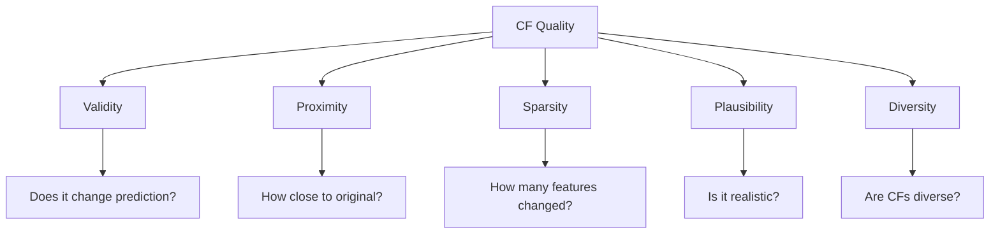

# Benchmarks

Systematic evaluation of counterfactual explanation methods using standardized metrics and datasets.

## Overview

The benchmarking framework enables:

- **Fair comparison** of different CF methods
- **Reproducible experiments** with Hydra configs
- **Comprehensive metrics** covering multiple quality dimensions
- **Automated logging** via MLflow

## Sections

| Section | Description |
|---------|-------------|
| [Evaluation Metrics](metrics.md) | Definitions and usage of all available metrics |
| [Benchmark Results](results.md) | Comparison tables and analysis |
| [Running Benchmarks](running.md) | How to reproduce and extend benchmarks |

## Key Metrics

Counterfactual quality is assessed across multiple dimensions:



## Quick Benchmark

```python
from cel.metrics import MetricsOrchestrator

# Initialize metrics
orchestrator = MetricsOrchestrator(
    metrics=["validity", "proximity_l2", "sparsity", "plausibility"],
    gen_model=flow_model
)

# Compute metrics
results = orchestrator.compute(
    x_cfs=counterfactuals,
    x_origs=original_instances,
    y_targets=target_labels,
    classifier=model
)

for metric, value in results.items():
    print(f"{metric}: {value:.4f}")
```

## Results Summary

| Method | Validity | Proximity | Sparsity | Plausibility |
|--------|----------|-----------|----------|--------------|
| PPCEF | 0.95 | 0.82 | 0.71 | **0.89** |
| DICE | **0.98** | 0.75 | 0.65 | 0.62 |
| GLOBE-CE | 0.91 | **0.88** | **0.78** | 0.71 |

See [Benchmark Results](results.md) for complete comparisons.
