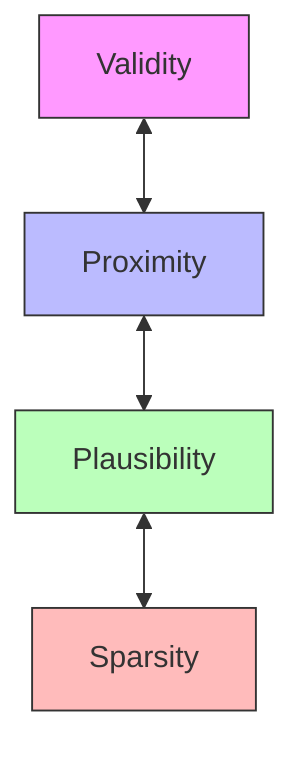

# Core Concepts

Understanding the fundamentals of counterfactual explanations.

## What Are Counterfactual Explanations?

A **counterfactual explanation** describes the smallest change to input features that would result in a different prediction. They answer questions like:

> "What would need to be different for the model to make a different decision?"

!!! example "Loan Application Example"
    **Original**: Application denied (income: $45,000, debt ratio: 35%)

    **Counterfactual**: "If your income were $52,000 OR your debt ratio were 28%, the loan would be approved."

## Key Properties

Good counterfactual explanations should be:

### 1. Valid

The counterfactual should actually change the prediction to the target class.

$$f(x') = y_{\text{target}}$$

### 2. Proximal

The counterfactual should be close to the original instance (minimal changes).

$$\min \|x' - x\|$$

### 3. Sparse

Only a few features should change (interpretability).

$$\min \|x' - x\|_0$$

### 4. Plausible

The counterfactual should be a realistic data point, not an adversarial example.

$$p(x') > \tau$$

### 5. Actionable

Changes should respect real-world constraints (e.g., age can only increase).

## Method Categories

### Local Methods

Generate counterfactuals for **individual instances**.

```
Instance x → Method → Counterfactual x'
```

**Use cases:**
- Individual recourse
- Debugging specific predictions
- Personalized recommendations

**Examples:** PPCEF, DICE, WACH

### Global Methods

Find **universal transformations** across a dataset.

```
Dataset X → Method → Transformation T
For all x: T(x) → counterfactual
```

**Use cases:**
- Policy insights
- Understanding systematic patterns
- Interventions at scale

**Examples:** GLOBE-CE, AReS

### Group Methods

Generate counterfactuals for **clusters** of similar instances.

```
Dataset X → Clustering → Groups
Each group → Method → Group counterfactual
```

**Use cases:**
- Semi-personalized recourse
- Demographic subgroups
- Scalable explanations

**Examples:** GLANCE, T-CREx

## The Role of Generative Models

Many methods use **normalizing flows** (generative models) to ensure plausibility:


### Why Flows?

1. **Density estimation**: Compute $p(x')$ to assess plausibility
2. **Sampling**: Generate candidates from high-density regions
3. **Invertibility**: Map between data and latent space

### Available Flows

| Flow | Description |
|------|-------------|
| MAF | Masked Autoregressive Flow - flexible, expressive |
| RealNVP | Affine coupling - fast, stable |
| NICE | Volume-preserving - simple, fast |
| CNF | Continuous - for regression |

## Actionability Constraints

Real-world counterfactuals must respect constraints:

### Immutable Features

Features that cannot change (e.g., race, birth country):

```python
actionable_features = ["income", "education", "work_hours"]
# Excludes: age, gender, race
```

### Monotonicity

Features that can only change in one direction:

```python
constraints = {
    "age": "increasing",      # Age can only increase
    "credit_score": "any",    # Can go either way
}
```

### Bounds

Valid ranges for features:

```python
bounds = {
    "age": (18, 100),
    "income": (0, None),  # No upper bound
}
```

## Evaluation Metrics

Counterfactuals are evaluated on multiple dimensions:

| Dimension | Metric | Question |
|-----------|--------|----------|
| Validity | Coverage, Validity | Does it work? |
| Proximity | L1, L2, MAD | How close? |
| Sparsity | Feature count | How many changes? |
| Plausibility | Log-likelihood, LOF | Is it realistic? |
| Diversity | Pairwise distance | Are CFs different? |

## Trade-offs

There are inherent trade-offs between properties:



- **Validity vs Proximity**: Closer CFs may not change the prediction
- **Sparsity vs Validity**: Fewer changes may not be enough
- **Plausibility vs Proximity**: Realistic points may be farther away

Different methods balance these trade-offs differently.

## Next Steps

- [Working with Datasets](../user-guide/datasets.md) - Load and configure data
- [Methods Overview](../methods/index.md) - Explore available methods
- [Evaluation Metrics](../benchmarks/metrics.md) - Understand quality metrics
