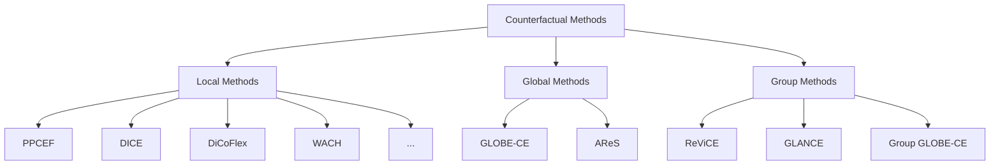

# CEL: Counterfactual Explanations Library

A comprehensive Python framework for generating and evaluating counterfactual explanations in machine learning models.

---

**CEL** (Counterfactual Explanations Library) provides a unified framework for counterfactual explanation methods, datasets, and evaluation metrics. Whether you're researching new methods, benchmarking existing approaches, or building explainable AI systems, this library has you covered.

## Features

<div class="feature-grid" markdown>

<div class="feature-item" markdown>
**17+ Explanation Methods**

Local, global, and group-level counterfactual methods including PPCEF, DiCE, GLOBE-CE, and more.

[Explore Methods →](methods/index.md)
</div>

<div class="feature-item" markdown>
**22 Pre-configured Datasets**

Ready-to-use datasets for classification and regression tasks with built-in preprocessing.

[View Datasets →](datasets/index.md)
</div>

<div class="feature-item" markdown>
**18+ Evaluation Metrics**

Comprehensive metrics for validity, proximity, sparsity, plausibility, and diversity.

[See Metrics →](benchmarks/metrics.md)
</div>

<div class="feature-item" markdown>
**End-to-End Pipelines**

Hydra-based configuration system for reproducible experiments with MLflow logging.

[Run Pipelines →](user-guide/pipelines.md)
</div>

</div>

## Quick Start

### Installation

```bash
# Using uv (recommended)
uv sync

# Or using pip
pip install -e .
```

### Generate Your First Counterfactual

```python
from counterfactuals.datasets import FileDataset
from counterfactuals.models.classifiers import MLPClassifier
from counterfactuals.models.generators import MaskedAutoregressiveFlow
from counterfactuals.cf_methods.local_methods import PPCEF

# 1. Load dataset
dataset = FileDataset(config_path="config/datasets/adult.yaml")

# 2. Train classifier
classifier = MLPClassifier(input_dim=14, hidden_dims=[64, 32], output_dim=2)
classifier.fit(train_loader, test_loader, epochs=50)

# 3. Train generative model
flow = MaskedAutoregressiveFlow(input_dim=14, hidden_dims=[64, 64], n_layers=5)
flow.fit(train_loader, test_loader, epochs=100)

# 4. Generate counterfactual (using PPCEF - one of 17+ available methods)
method = PPCEF(gen_model=flow, disc_model=classifier, ...)
result = method.explain(X=instance, y_origin=0, y_target=1, ...)

print(f"Original: {instance}")
print(f"Counterfactual: {result.x_cfs}")
```

[Full Quick Start Tutorial →](getting-started/quickstart.md){ .md-button .md-button--primary }

## Method Categories

The library organizes counterfactual methods into three categories:



| Category | Scope | Best For |
|----------|-------|----------|
| **Local** | Single instance | Individual recourse, debugging |
| **Global** | Entire dataset | Policy insights, systematic patterns |
| **Group** | Subpopulations | Semi-personalized recourse |

## Why Counterfactuals?

Counterfactual explanations answer: *"What would need to change for a different outcome?"*

!!! example "Example"
    **Loan Application Denied**

    *"If your income were $5,000 higher OR your debt-to-income ratio were below 30%, your loan would be approved."*

This provides **actionable recourse** - concrete steps users can take to achieve their desired outcome.

## Architecture


## Next Steps

<div class="feature-grid" markdown>

<div class="feature-item" markdown>
📥 **Get Started**

Install the library and run your first example.

[Installation Guide](getting-started/installation.md)
</div>

<div class="feature-item" markdown>
📖 **Learn the Basics**

Understand core concepts and workflows.

[User Guide](user-guide/index.md)
</div>

<div class="feature-item" markdown>
📊 **Compare Methods**

See benchmark results across methods.

[Benchmark Results](benchmarks/results.md)
</div>

<div class="feature-item" markdown>
🔌 **API Reference**

Detailed documentation for all modules.

[API Docs](reference/index.md)
</div>

</div>

## Citation

If you use this library in your research, please cite:

### CEL Library

```bibtex
@software{cel,
  author = {Furman, Oleksii and Lenkiewicz, Łukasz and Musiałek, Marcel},
  title = {CEL: Counterfactual Explanations Library},
  url = {https://github.com/ofurman/counterfactuals},
  year = {2026}
}
```

### Original PPCEF Research

If you specifically use the PPCEF method, please also cite:

```bibtex
@inbook{ppcef,
  author = {Wielopolski, Patryk and Furman, Oleksii and Stefanowski, Jerzy and Zieba, Maciej},
  year = {2024},
  month = {10},
  pages = {},
  title = {Probabilistically Plausible Counterfactual Explanations with Normalizing Flows},
  isbn = {9781643685489},
  doi = {10.3233/FAIA240584}
}
```

## License

This project is licensed under the MIT License.
