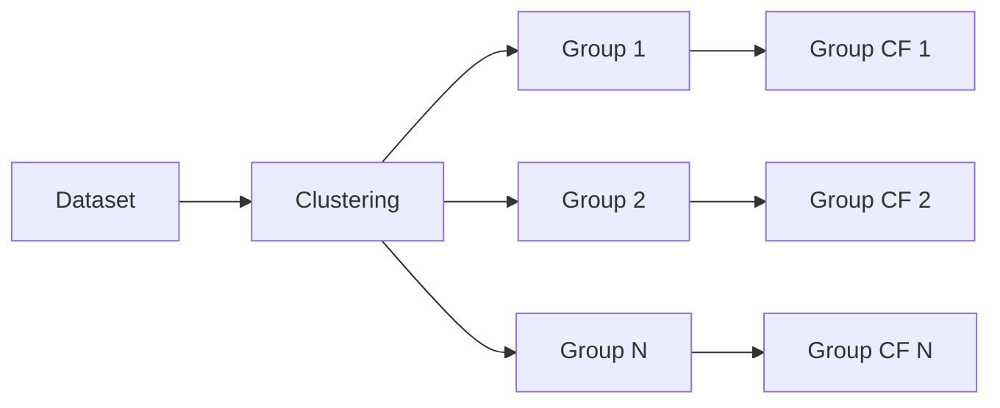

# Group Methods

Group counterfactual methods generate explanations for **clusters or subgroups** of similar instances. They balance individual precision with broader applicability.

## Available Methods

| Method | Description | Key Feature |
|--------|-------------|-------------|
| [GLANCE](glance.md) | Group-level anchor counterfactuals | Anchor-based grouping |
| [T-CREx](tcrex.md) | Temporal counterfactual rule extraction | Rule-based group explanations |

## When to Use Group Methods

Group methods are ideal when you need to:

- Provide explanations for **similar users**
- Balance **personalization** with **scalability**
- Identify **subpopulation-specific** patterns
- Generate **semi-personalized recourse**

## How Groups Are Formed

Group methods typically cluster instances based on:

- Feature similarity
- Prediction confidence
- Demographic attributes
- Custom grouping criteria



## Example Usage

```python
from cel.cf_methods.group_methods import GLANCE

# Initialize method
method = GLANCE(
    gen_model=flow_model,
    disc_model=classifier,
    disc_model_criterion=criterion,
    device="cuda"
)

# Generate group counterfactuals
result = method.explain(
    X=X_test,
    y_origin=y_test,
    y_target=target_class,
    X_train=X_train,
    y_train=y_train,
    n_groups=5  # Number of groups
)

# Each instance is assigned to a group
print(f"Group assignments: {result.cf_group_ids}")
```
