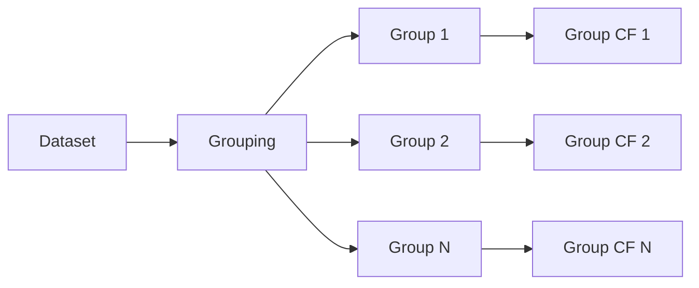

# Group Methods

Group counterfactual methods generate explanations for **clusters or subgroups** of similar instances. They balance individual precision with broader applicability.

## Available Methods

| Method | Description | Key Feature |
|--------|-------------|-------------|
| [GLANCE](glance.md) | Cluster-and-merge group counterfactuals | Action averaging over k-means clusters |
| [TCREx](tcrex.md) | Tree-based counterfactual rules | Hyperrectangle rules via surrogate tree |
| [Group GLOBE-CE](group-globe-ce.md) | Per-cluster GLOBE-CE | KMeans partition + per-cluster global translations |

## When to Use Group Methods

Group methods are ideal when you need to:

- Provide explanations for **similar users**
- Balance **personalization** with **scalability**
- Identify **subpopulation-specific** patterns
- Generate **semi-personalized recourse**

## How Groups Are Formed

Group methods in this package form groups via:

- k-means clustering followed by greedy merging (GLANCE)
- Decision-tree leaves filtered by accuracy and feasibility (TCREx)


```mermaid
flowchart LR
    A[Dataset] --> B[Grouping]
    B --> C[Group 1]
    B --> D[Group 2]
    B --> E[Group N]
    C --> F[Group CF 1]
    D --> G[Group CF 2]
    E --> H[Group CF N]
```

## Example Usage

```python
from cel.cf_methods.group_methods import GLANCE

method = GLANCE(
    X_test=X_test,
    y_test=y_test,
    model=classifier,
    features=feature_names,
    k=-1,
    s=4,
    m=1,
    target_class=1,
)

result = method.explain(
    X=X_test,
    y_origin=y_test,
    y_target=y_target,
    X_train=X_train,
    y_train=y_train,
)

# Each instance is assigned to a group
print(f"Group assignments: {result.cf_group_ids}")
```
