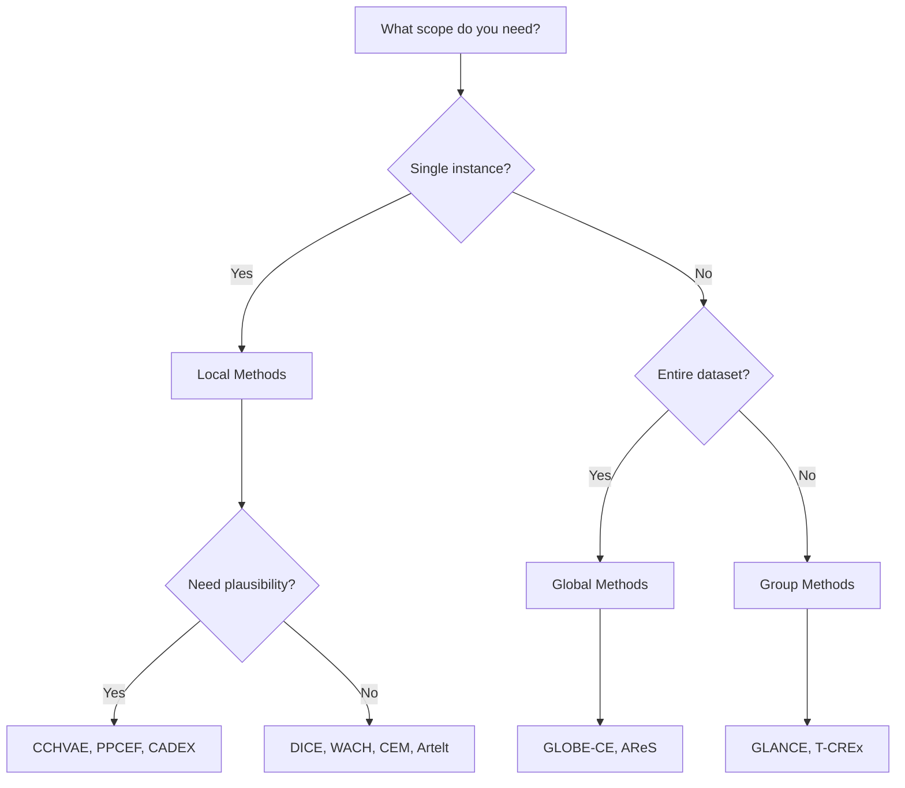

# Counterfactual Methods

The library implements **14 counterfactual explanation methods** organized into three categories based on their scope.

## Method Categories

### Local Methods

Local methods generate counterfactuals for **individual instances**. Given a single input, they find the minimal change needed to alter the model's prediction.

[Explore Local Methods →](local/index.md){ .md-button }

### Global Methods

Global methods find **universal transformations** that work across an entire dataset or subpopulation, providing insights into systematic patterns.

[Explore Global Methods →](global/index.md){ .md-button }

### Group Methods

Group methods generate counterfactuals for **clusters or subgroups** of similar instances, balancing individual precision with broader applicability.

[Explore Group Methods →](group/index.md){ .md-button }

## Method Comparison

| Method | Category | Plausibility | Diversity | Actionability | Speed | Best For |
|--------|----------|--------------|-----------|---------------|-------|----------|
| WACH | Local | Low | Low | No | Fast | Simple gradient-based CF |
| Artelt | Local | Medium | Low | Yes | Fast | Heuristic-based CF |
| DICE | Local | Medium | High | Yes | Fast | Fast, diverse CFs |
| CCHVAE | Local | High | Medium | Yes | Slow | VAE-based CF |
| PPCEF | Local | High | Medium | Yes | Medium | Normalizing flow-based CF |
| CEM | Local | Medium | Low | Yes | Medium | Contrastive explanations |
| CEGP | Local | Medium | Low | Yes | Medium | Genetic programming CF |
| CADEX | Local | High | Low | Yes | Medium | Optimization-based CF |
| SACE | Local | Medium | Medium | Yes | Medium | Strategy-based CF |
| CEARM | Local | Medium | Low | Yes | Medium | Rule-based CF |
| GLOBE-CE | Global | Medium | N/A | Yes | Fast | Dataset-wide patterns |
| AReS | Global | Medium | N/A | Yes | Medium | Actionable rules |
| GLANCE | Group | Medium | High | Yes | Fast | Cluster-level CFs |
| T-CREx | Group | Medium | High | Yes | Medium | Rule-based group CFs |

## Choosing a Method



## Common Interface

All methods inherit from `BaseCounterfactualMethod` and share a common interface:

```python
from cel.cf_methods import BaseCounterfactualMethod


class YourMethod(BaseCounterfactualMethod):
    def fit(self, X_train, y_train, **kwargs):
        """Prepare the method (optional)."""
        pass

    def explain(self, X, y_origin, y_target, **kwargs):
        """Generate counterfactual explanations."""
        return ExplanationResult(...)
```
