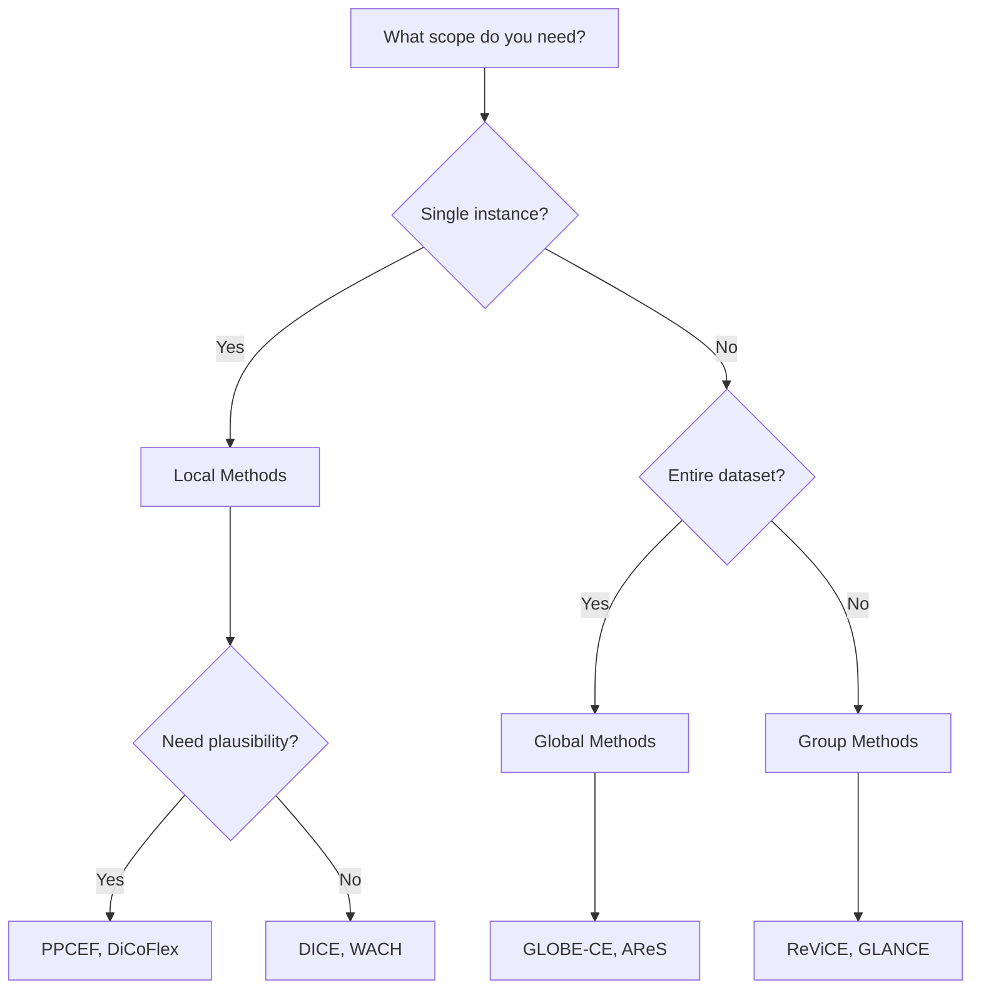

# Counterfactual Methods

The library implements **17+ counterfactual explanation methods** organized into three categories based on their scope.

## Method Categories

### Local Methods

Local methods generate counterfactuals for **individual instances**. Given a single input, they find the minimal change needed to alter the model's prediction.

[Explore Local Methods :material-arrow-right:](local/index.md){ .md-button }

### Global Methods

Global methods find **universal transformations** that work across an entire dataset or subpopulation, providing insights into systematic patterns.

[Explore Global Methods :material-arrow-right:](global/index.md){ .md-button }

### Group Methods

Group methods generate counterfactuals for **clusters or subgroups** of similar instances, balancing individual precision with broader applicability.

[Explore Group Methods :material-arrow-right:](group/index.md){ .md-button }

## Method Comparison

| Method | Category | Plausibility | Diversity | Actionability | Speed |
|--------|----------|--------------|-----------|---------------|-------|
| PPCEF | Local | High | Medium | Yes | Medium |
| DICE | Local | Medium | High | Yes | Fast |
| DiCoFlex | Local | High | High | Yes | Medium |
| GLOBE-CE | Global | Medium | N/A | Yes | Fast |
| ReViCE | Group | High | Medium | Yes | Medium |

## Choosing a Method



## Common Interface

All methods inherit from `BaseCounterfactualMethod` and share a common interface:

```python
from counterfactuals.cf_methods import BaseCounterfactualMethod

class YourMethod(BaseCounterfactualMethod):
    def fit(self, X_train, y_train, **kwargs):
        """Prepare the method (optional)."""
        pass

    def explain(self, X, y_origin, y_target, **kwargs):
        """Generate counterfactual explanations."""
        return ExplanationResult(...)
```
