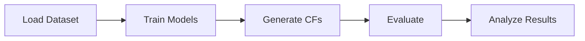

# User Guide

This guide covers the main workflows for using the Counterfactuals library.

## Overview

The library provides a complete pipeline for generating and evaluating counterfactual explanations:



## Sections

| Section | Description |
|---------|-------------|
| [Working with Datasets](datasets.md) | Load and configure datasets for counterfactual generation |
| [Training Models](models.md) | Train discriminative and generative models |
| [Generating Counterfactuals](generating-counterfactuals.md) | Use various methods to generate explanations |
| [Evaluating Results](evaluation.md) | Assess counterfactual quality with metrics |
| [Running Pipelines](pipelines.md) | Execute end-to-end experiments with Hydra |

## Quick Reference

### Basic Workflow

```python
from cel.datasets import FileDataset
from cel.models.classifiers import MLPClassifier
from cel.models.generators import MaskedAutoregressiveFlow
from cel.cf_methods.local_methods import PPCEF

# 1. Load dataset
dataset = FileDataset(config_path="config/datasets/adult.yaml")

# 2. Train models
classifier = MLPClassifier(...)
gen_model = MaskedAutoregressiveFlow(...)

# 3. Generate counterfactuals
method = PPCEF(gen_model, classifier, ...)
result = method.explain(X, y_origin, y_target, ...)

# 4. Evaluate
from cel.metrics import MetricsOrchestrator

metrics = MetricsOrchestrator(...)
scores = metrics.compute(result)
```
